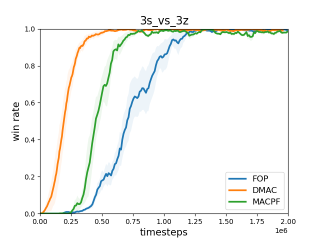

# FOP, DMAC and MACPF

## Note

The implementation of the following methods can be found in this codebase:
- [**FOP**: Factorizing Optimal Joint Policy of Maximum-Entropy Multi-Agent Reinforcement Learning](http://proceedings.mlr.press/v139/zhang21m/zhang21m.pdf)
- [**DMAC**: Divergence-Regularized Multi-Agent Actor-Critic](https://arxiv.org/abs/2110.00304)
- [**MACPF**: More Centralized Training, Still Decentralized Execution: Multi-Agent Conditional Policy Factorization](https://arxiv.org/abs/2209.12681) 

## Installation

- 1. install SMAC following https://github.com/oxwhirl/smac
- 2. install required packages: pip install -r requirements.txt 

## How to run

```
CUBLAS_WORKSPACE_CONFIG=:16:8 python3 src/main.py --config=fop/dmac/dfop --env-config=sc2 with env_args.map_name=2c_vs_64zg seed=1
```
Environment variable **CUBLAS_WORKSPACE_CONFIG** is recommended to enforce deterministic behavior of RNN.

## Results

Here, we provide results in three different SMAC scenarios using default hyperparameters.
 <center class="half">
           
</center>

## Citation

### Citation

If you are using the codes, you are welcomed cite our paper.

[Tianhao Zhang, Yueheng Li, Chen Wang, Guangming Xie and Zongqing Lu. *FOP: Factorizing Optimal Joint Policy of Maximum-Entropy Multi-Agent Reinforcement Learning*. ICML'21.](https://arxiv.org/abs/1810.09202)

    @inproceedings{zhang2021fop,
            title={Fop: Factorizing optimal joint policy of maximum-entropy multi-agent reinforcement learning},
            author={Zhang, Tianhao and Li, Yueheng and Wang, Chen and Xie, Guangming and Lu, Zongqing},
            booktitle={International Conference on Machine Learning},
            pages={12491--12500},
            year={2021},
            organization={PMLR}
    }

[Tianhao Zhang, Yueheng Li, Chen Wang, Guangming Xie and Zongqing Lu. *Divergence-Regularized Multi-Agent Actor-Critic*. ICML'22.](https://arxiv.org/abs/1810.09202)

    @inproceedings{zhang2021fop,
            title={Fop: Factorizing optimal joint policy of maximum-entropy multi-agent reinforcement learning},
            author={Zhang, Tianhao and Li, Yueheng and Wang, Chen and Xie, Guangming and Lu, Zongqing},
            booktitle={International Conference on Machine Learning},
            pages={12491--12500},
            year={2021},
            organization={PMLR}
    }

[Tianhao Zhang, Yueheng Li, Chen Wang, Guangming Xie and Zongqing Lu. *FOP: Factorizing Optimal Joint Policy of Maximum-Entropy Multi-Agent Reinforcement Learning*. ICML'21.](https://arxiv.org/abs/1810.09202)

    @inproceedings{zhang2021fop,
            title={Fop: Factorizing optimal joint policy of maximum-entropy multi-agent reinforcement learning},
            author={Zhang, Tianhao and Li, Yueheng and Wang, Chen and Xie, Guangming and Lu, Zongqing},
            booktitle={International Conference on Machine Learning},
            pages={12491--12500},
            year={2021},
            organization={PMLR}
    }